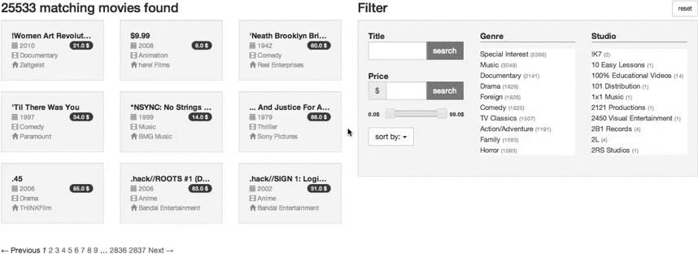

[](https://travis-ci.org/fortytools/forty_facets)
[](https://coveralls.io/r/fortytools/forty_facets?branch=master)
[](https://codeclimate.com/github/fortytools/forty_facets)
[](https://www.omniref.com/ruby/gems/forty_facets)

# FortyFacets

FortyFacets lets you easily build explorative search interfaces based on fields of your ActiveRecord models.



See it implemented in a [example rails application](https://github.com/FortySource/forty_facets_demo/tree/main) or
try a [working demo]( https://forty-facets.herokuapp.com/ "Testinstallation on heroku")!

It offers a simple API to create an interactive UI to browse your data by iteratively adding
filter values.

The search is purely done via SQL queries, which are automatically generated via the AR-mappings.

Narrowing down the search result is done purely via `GET` requests. This way all steps are bookmarkable. This way the search natively works together with turbolinks as well.

There is no JavaScript involved. The collection returned is a normal ActiveRecord collection - this way it works seamlessly together with other GEMs like will_paginate

## Installation

Add this line to your application's Gemfile:

    gem 'forty_facets'

And then execute:

    $ bundle

Or install it yourself as:

    $ gem install forty_facets

## Usage

You can clone a working example at https://github.com/fortytools/forty_facets_demo

If you have Movies with a textual title, categotized by genre, studio and year with studios belonging to a country...

    class Movie < ActiveRecord::Base
      belongs_to :year
      belongs_to :studio
      has_and_belongs_to_many :genres

      scope :classics, -> { where("year <= ?", 1980) }
    end

You can then declare the structure of your search like so:

```ruby
class HomeController < ApplicationController

  class MovieSearch < FortyFacets::FacetSearch
    model 'Movie' # which model to search for
    text :title   # filter by a generic string entered by the user
    scope :classics   # only return movies which are in the scope 'classics'
    range :price, name: 'Price' # filter by ranges for decimal fields
    facet :year, name: 'Releaseyear', order: :year # additionally order values in the year field
    facet :studio, name: 'Studio', order: :name
    facet :genres, name: 'Genre' # generate a filter with all values of 'genre' occuring in the result
    facet [:studio, :country], name: 'Country' # generate a filter several belongs_to 'hops' away

    orders 'Title' => :title,
           'price, cheap first' => "price asc",
           'price, expensive first' => {price: :desc, title: :desc}
    custom :for_manual_handling

  end

  def index
    @search = MovieSearch.new(params) # this initializes your search object from the request params
    @movies = @search.result.paginate(page: params[:page], per_page: 5) # optionally paginate through your results
  end
```

In your view you can iterate the result like any other ActiveRecord collection

```haml
%table.table.table-condensed
  %tbody
    - @movies.each do |movie|
      %tr
        %td
          %strong=movie.title
```

Use the search object to display further narrowing options to the user

```haml
- filter = @search.filter(:genre)
.col-md-4
  .filter
    .filter-title= filter.name
    .filter-values
      %ul.selected
        - filter.selected.each do |genre|
          %li= link_to genre.name, filter.remove(genre).path
      %ul.selectable
        - filter.facet.reject(&:selected).each do |facet_value|
          - genre = facet_value.entity
          %li
            = link_to genre.name, filter.add(genre).path
            %span.count= "(#{facet_value.count})"
```
## API

### Base class

To create a custom search subclass `FortyFacets::FacetSearch`.

```ruby
class MySearch
  model 'MyActiveRecordModel' # replace this with an class name from your models folder
end
```

### Available declaration methods
| keyword | options       |                                                                                                                         |
|---------|---------------|-------------------------------------------------------------------------------------------------------------------------|
| text    | prefix:true   | creates a filter to limit search result to entities containing the filter value in the given field                      |
| scope   |               | creates a filter to limit search result to entities matching the scope with the given name                              |
| facet   |               | creates a facetted filter on the specified model attribute (attribute or belongs_to)                                    |
| range   |               | creates a range filter (param format 'FROM - TO') limiting result to entities with values in that range              | 
| orders  |               | takes a hash mapping a label to an argument that the active record `order` method can be called with to sort the result |
| custom  |               | doesnt affect the query directly, just handles the request param. access via @search.filter(:custom_filter).set(..) /@search.filter(:custom_filter).value |

## FAQ

### What kind of associations can be searched/filtered for?

At the moment you can facet for entities mapped via a standard `belongs_to` or `has_and_belongs_to` association. 

## Contributing

1. Fork it ( http://github.com/fortytools/forty_facets/fork )
2. Create your feature branch (`git checkout -b my-new-feature`)
3. Commit your changes (`git commit -am 'Add some feature'`)
4. Push to the branch (`git push origin my-new-feature`)
5. Create new Pull Request
